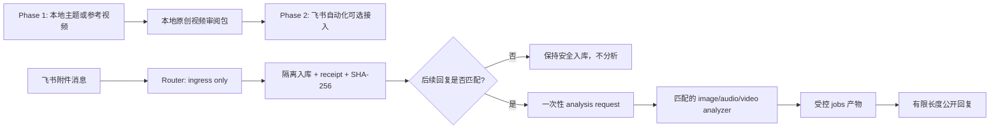

# OpenClaw VideoFactory

OpenClaw VideoFactory 是一个运行在 Windows 本机上的短视频生产工程。它首先提供由 Codex 驱动的本地主题/参考视频到原创短视频闭环；在该闭环稳定后，才由 OpenClaw 编排飞书选题、受控交付和自动化运营。

本仓库同时保留历史 P0 飞书安全证据与本地视频工厂候选。当前产品重点是 Phase 1 本地成片，不是已经完成生产自动化的“黑盒脚本”，也不会绕过项目门禁替用户自动发布抖音。

GitHub：<https://github.com/Jovifei/OpenClaw_VideoFactory>

## Phase 1 cloneable local Pink Pig Video Factory

The cloneable offline baseline lives under `video_factory/` and does not
require OpenClaw, Feishu, Gateway, OAuth, Binding, or Cron. After installing
Python dependencies and ensuring `ffmpeg`/`ffprobe` are on `PATH`, run:

```powershell
python -m pip install -r requirements-bootstrap.txt -r requirements-p1-candidate.txt
python generate_video.py --config examples/pink_pig_demo/config.yaml
```

See [`video_factory/README.md`](video_factory/README.md) for legacy, job, and
AI Director topic-mode commands. Runtime outputs under `dist/`, local session
memory, historical probes, and control-plane state are intentionally excluded
from the cloneable baseline.

> The command above is an existing candidate baseline, not evidence that Phase 1
> has passed and not authorization to run an external Provider. Phase 1 needs
> separately retained reproducible outputs and human review. Local TTS is a
> local component; a remote TTS or AI Director Provider requires its own
> approved integration scope and preflight.

## 1. 工程目标与交付顺序

完整阶段定义见 [`docs/PRODUCT_PHASES.md`](docs/PRODUCT_PHASES.md)。先完成本地成片，飞书自动化是后续 Phase 2：

```text
Phase 1（当前）
Jovi 给主题 / 本地参考视频 / 明确授权的公开主题研究
  → 研究与事实核查 → 原创脚本与分镜 → AI TTS → 字幕对齐
        ↓
技术图/程序化画面 → 可选 ComfyUI 素材 → Remotion 合成
        ↓
FFmpeg/NVENC 导出 → 质量门禁 → 本地人工审阅包

Phase 2（仅 Phase 1 通过后）
飞书安全入站/出站 → 08:30 候选卡 → 用户选择或 12:00 合格兜底
→ 受控飞书交付 → 用户人工发布抖音
```

内容定位是“嵌入式工程主线 + AI 热点副线”，品牌角色是小粉飞猪。热点内容必须有日期、可靠来源和工程影响；角色只辅助表达，不遮挡代码、协议帧、图表或字幕。

## 2. 设计原则与边界

- Phase 1 的状态与工件是 job-scoped 本地目录；不依赖 OpenClaw、飞书、lark-cli 或 Cron。Phase 2 才由 OpenClaw 负责飞书入口、路由、日常任务状态、重试、取消、恢复和通知。
- 外部输入、文件名、字幕、二维码和媒体元数据全部按不可信数据处理。
- Phase 1 的本地参考视频只用于主题、结构和通用表达线索分析；所有原始参考内容保持只读并重新创作。Phase 2 附件先隔离入库、校验 MIME 和 SHA-256、生成 receipt，再决定是否分析；附件消息本身不触发分析。
- Phase 1 基线不得依赖 GPU、ComfyUI 或 NVENC；它们只是在已有获批组件上可选的加速，不能触发模型/节点下载或成为本阶段验收条件。若参考分析会接近复制镜头顺序、节拍或可识别包装，应停止在 Phase 1 的保守边界，转入 Phase 4 审查。
- 分析必须由同一群组、同一发送者对原附件的后续明确回复触发，并且只消费一次性 Ticket。
- 分析器只读取隔离副本，不能获得原始 `MediaPath`、URL、`file_key` 或飞书凭据。
- GPU 重任务串行使用共享媒体锁；视频的 ffprobe 和 CPU 抽帧不占用 GPU 锁，Whisper/VLM/ComfyUI 才需要 GPU 锁。
- 不自动发布抖音、不绕过验证码、不自动下载模型或节点、不解析 DOCX/PDF 正文、不把本地测试报告冒充生产验收。

## 3. 核心架构

| 组件 | 责任 | 当前状态 |
| --- | --- | --- |
| 本地 Codex Video Factory | Phase 1：主题/本地参考视频到本地审阅包 | 当前主交付目标 |
| OpenClaw Feishu Channel | Phase 2：接收群消息和附件，维护会话与通知 | 历史能力，仍受 P0 验收约束 |
| `video-factory` Router | 纯文本路由；识别意图但不直接理解媒体 | 已按单群、单消费者规则收敛 |
| `ingest_attachment` MCP | 隔离复制、MIME/大小校验、SHA-256、receipt | P0 核心能力 |
| `analyzers` MCP | 图片、音频、视频的后置分析工具 | 3 个工具，分析器无飞书 Binding |
| GPU media lock | 串行化 Whisper、VLM、ComfyUI 等重 GPU 任务 | 已实现并有离线测试 |
| `jobs/<job_id>/` 产物 | 保存受控 analysis/transcript 结果 | 运行时目录，不提交 Git |
| Remotion/FFmpeg | 生成和导出短视频 | Phase 1–3 逐阶段实现 |



## 4. 媒体分析协议

真实飞书客户端把“上传附件”和“请求分析”作为两条消息处理：

1. 上传附件：只做入库，回复解析编号；不 OCR、不转录、不抽帧。
2. 回复附件：必须携带真实 `reply_to_message_id`，并匹配群组、发送者、附件序号、SHA-256 和媒体类型。
3. 创建一次性请求：使用新 Ticket 触发对应 Analyzer。
4. 返回结果：从服务端生成的 JSON 产物读取展示内容；路径、Token、原始媒体数据不会回传给群聊。

命令形式：

```text
/vf text  <new-ticket>
/vf image <new-ticket>
/vf audio <new-ticket>
/vf video <new-ticket>
```

聊天记录中的 Ticket 视为已暴露，不能复制重试；每次真实复测都必须重新上传文件并取得新 Ticket。

## 5. 当前能力与证据边界

| 能力 | 当前结论 |
| --- | --- |
| TXT `text/plain` | 显式 Ticket 分析已修复；目标回归 170/170；真实文本回复已返回摘要和结构信息 |
| 图片 | 安全入库和图片摘要/OCR 展示链路已有真实样例；仍需按 P0 矩阵补齐完整证据 |
| 音频 | faster-whisper CUDA 已完成真实转录，完整英文测试句已返回；顶层 `transcript.json` 展示链路已修复 |
| MP4 视频 | R5 真实复测已完成：4 秒 MP4 通过 ffprobe，`analyze_video` 完成并抽取 3 帧，用户收到可见完成回复；本机 `analyzers` MCP 请求窗口为 120 秒。 |
| DOCX/PDF | 只允许元数据、SHA-256 和隔离复制；不解析正文 |

当前产品阶段为 `PHASE_1_LOCAL_VIDEO_FACTORY`。历史 P0 飞书门仍保留为 Phase 2 前置；任何本地测试或候选 MP4 都不能直接推断 Phase 1、Phase 2 或 Provider 已通过。

## 6. 目录说明

```text
.
├── config/       配置模板、账号列定义、主题和媒体策略
├── scripts/      入站、Ticket、MCP、分析器、GPU 锁和验收脚本
├── services/     Feishu Gateway 与受控 RPC 接口
├── src/          后续视频工厂的 Python 领域代码
├── skills/       OpenClaw 本地 Skill（直接位于仓库根目录）
├── schemas/      事件、receipt、Ticket、主题和视频工作流契约
├── tests/        Python/Pester/Schema/Node 回归与安全边界测试
├── runbook/      从 Phase 1 本地成片到最终验收的操作顺序
├── handoff/codex/ 当前执行交接、决策和验收矩阵
├── reports/      历史证据、变更单和未来阶段报告
└── tasks/        当前计划、复盘和经验规则
```

运行时的 `input/`、`jobs/`、`media/`、`output/`、`state/`、模型缓存、研究文章和个人配置均不进入公开仓库。

## 7. 验证边界

历史 P0 媒体回归只适用于 Phase 2 飞书接入，不是 Phase 1 的启动要求：

```powershell
Set-Location E:\project\OpenClaw_VideoFactory
& .\.venv\Scripts\python.exe -m unittest `
  tests.test_analyzer_mcp `
  tests.test_analysis_request `
  tests.test_media_action_ticket `
  tests.test_ingest_attachment_core `
  tests.test_two_message_mcp_surface `
  tests.test_two_message_flow `
  tests.test_trusted_media_roots

& .\.venv\Scripts\python.exe -m py_compile scripts\mcp_ingest_attachment.py
```

首次运行前先阅读 `START_HERE_CODEX.md`、`PROJECT_STATUS.yaml` 和 `AGENTS.md`。任何配置写入都必须先查询实时 Schema、备份、校验、记录证据并准备回滚。

## 8. 分阶段路线图

| 阶段 | 目标 | 不提前做的事情 |
| --- | --- | --- |
| Phase 1 | 本地主题/参考视频主题分析到原创 MP4 与人工审阅包 | 不接飞书、Cron 或自动发布 |
| Phase 2 | 飞书安全、候选主题、用户选择、12:00 兜底、幂等恢复 | 不绕过 Phase 1 成片与安全门 |
| Phase 3 | 4070 SUPER、ComfyUI、Whisper、NVENC 的受控生产能力 | 不绕过 GPU 锁和授权门禁 |
| Phase 4 | 高级参考视频原创再创作约束 | 不复用原音、水印或连续原镜头 |
| Phase 5 | 可编辑剪映草稿导出 | 不让剪映成为唯一渲染器 |

## 9. 安全发布边界

仓库只保留可复现的代码、模板、测试、Runbook、任务信息和脱敏 P0 证据。`.env`、飞书凭据、`open_id/chat_id`、API Key、本机 OpenClaw 配置、入站媒体、Ticket 状态、分析产物和个人/研究文章都必须留在本机。

所有“通过”结论都必须对应真实日志、测试和产物。离线测试通过只证明代码契约；真实飞书事件、用户可见回复、GPU 运行和 P0 Gate 仍分别计证，不能互相替代。
