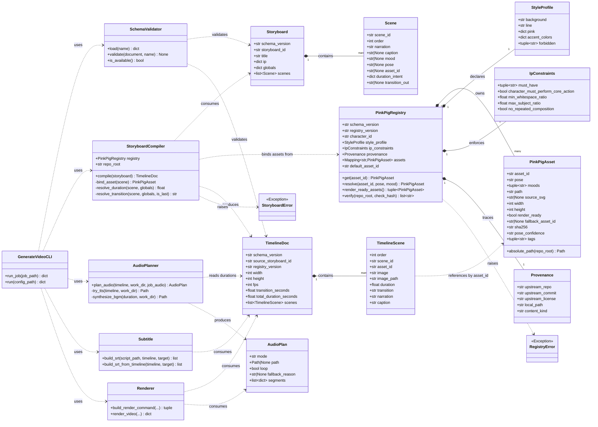
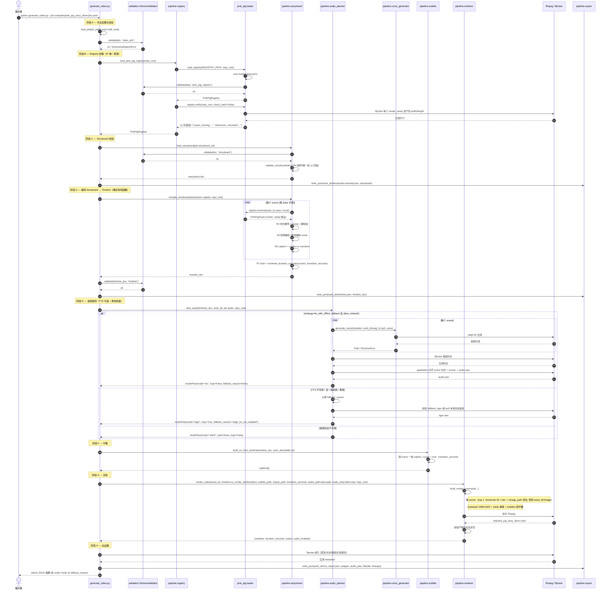
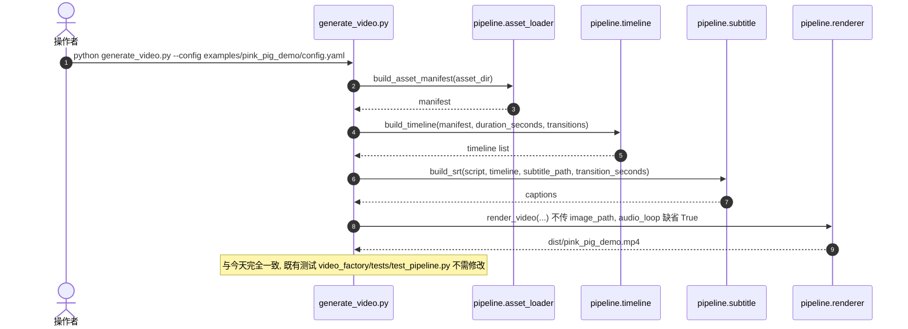
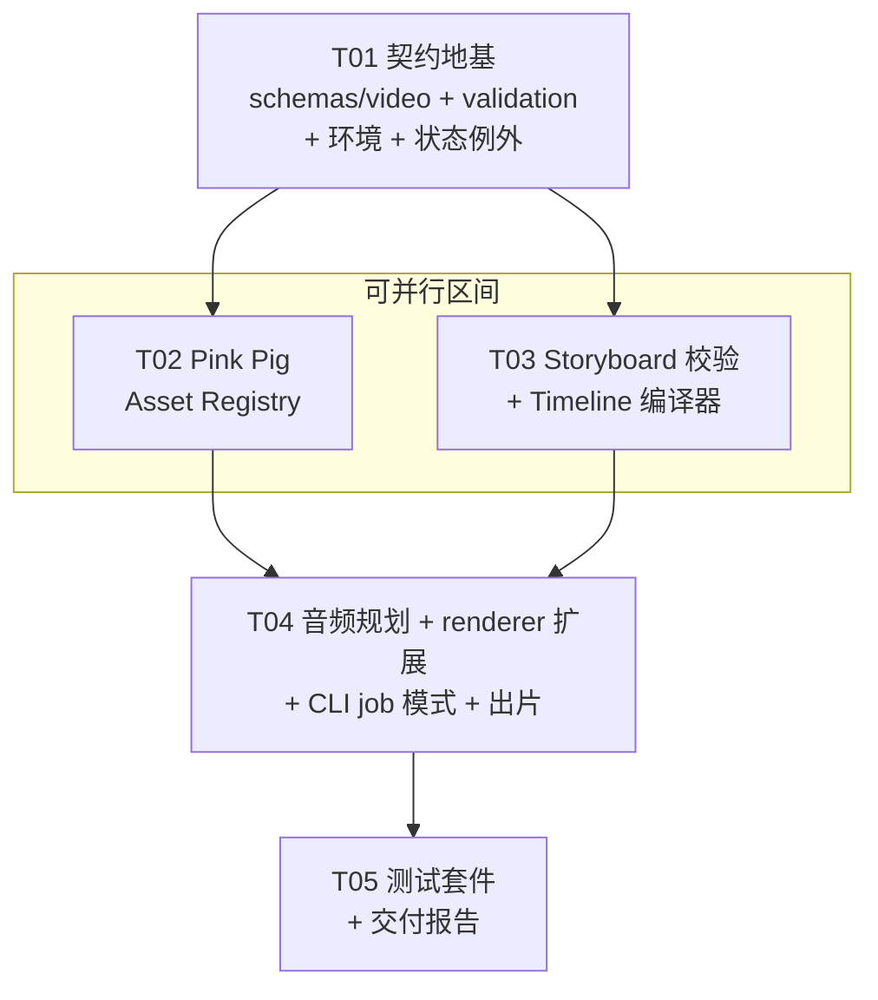

# PINK_PIG_VIDEO_FACTORY_PRODUCTIZATION_001 — Phase 1 系统设计

## Phase 1.5 Composition Engine（2026-08-09）

本加固把知识类视频的渲染约束提升为可验证合同，继续复用现有
`video_factory/`，不创建第二条 pipeline。

- `schemas/video/composition.schema.json` 固定 1080×1920 画布与四个安全区域：brand `y=80..180`、content `y=240..1040`、subtitle `y=1120..1580`、signature `y=1760..1860`。
- `SubtitleLayoutEngine` 在 FFmpeg 前验证字幕区域，使用 52–60px、左右 90px、最多两行的字幕样式；content/subtitle 冲突以 `subtitle_overlap_content` 失败。
- Registry 增加五张本地 Modbus RTU 知识插图和透明 `pink_pig.signature.v1`；上游 `ian-fenzhu-illustrations` 只提供 style DNA、persona 与 composition rules。
- Pink Pig quality gate 验证 registry asset、style profile、角色一致性、skill 加载、core action 和签名资产。
- `render_report.json` 增加 `assets_used`、`subtitle_region`、`layout_mode` 与 `style_profile`，并保留真实 ffprobe 字段。
- 可复核示例：`examples/pink_pig_modbus_demo/job.yaml` 生成四幕 Modbus RTU 视频；字幕只出现在 subtitle_area，知识插图只出现在 content_area。

本轮不实现 AI Director 新能力，不接入 Feishu/OpenClaw/Gateway/Binding/OAuth/Cron，也不改变 `PROJECT_STATUS.yaml` 的正式 P0/P1 状态。完整验收记录见 `reports/PINK_PIG_FACTORY_PHASE1_5_COMPOSITION.md`。

- 任务 ID: `PINK_PIG_VIDEO_FACTORY_PRODUCTIZATION_001`
- 架构师: 高见远 (Gao)
- 分支: `codex/product-optimization-093`
- 文档状态: Phase 1 已实现；002 加固完成；003 本地 AI Director 接口已实现
- 本轮范围: 产品化基础 Phase 1 与 003 本地 Director 预研。**不构成正式 P0/P1/P2 Gate 通过**。

---

## 0. 事实核查修正（与交接简报的差异，必须先读）

我在设计前重新核验了环境，发现两处与交接简报不一致，**设计已据此调整，工程师请以本节为准**：

| 项 | 简报说法 | 实测结果 | 影响 |
|---|---|---|---|
| `jsonschema` | 未安装 | **已安装** `4.26.0`（`envs/default`） | 无需安装 |
| `pytest` | 未安装 | **已安装** `9.1.1`（`envs/default`） | 无需安装 |
| `PyYAML` | 未提及 | **`envs/default` 与 `versions/3.13.12` 都没有** | **阻断项**：`generate_video.py` 顶层 `import yaml`，在这两个解释器上直接崩溃 |

实测矩阵（`python -c "import X"`）：

| 解释器 | 版本 | yaml | jsonschema | pytest | numpy | Pillow | edge_tts |
|---|---|---|---|---|---|---|---|
| `E:/project/OpenClaw_VideoFactory/.venv/Scripts/python.exe` | 3.14.2 | ✅ 6.0.3 | ✅ | ❌ | - | - | - |
| `C:/Users/Admin/.workbuddy/binaries/python/envs/default/Scripts/python.exe` | 3.13.14 | ❌ | ✅ 4.26.0 | ✅ 9.1.1 | ✅ 2.5.1 | ✅ 12.3.0 | ❌ |
| `C:/Users/Admin/.workbuddy/binaries/python/versions/3.13.12/python.exe` | 3.13.14 | ❌ | ❌ | ✅ | - | - | - |

**结论：没有任何一个解释器同时具备 `yaml` + `jsonschema` + `pytest`。**
决策：统一到 `envs/default`，**只需补装 1 个包 `PyYAML`**。不使用仓库 `.venv`（缺 pytest 且 Python 版本不同），不污染系统 Python。

第二处修正：`assets/pink_pig/pig01..05.png` 实测均为 **1080×1920 竖版**，而上游 style-DNA 规定 "16:9 横版"。两者语境不同（上游是文章配图规范，本项目是竖屏短视频），设计中已把该冲突显式降级处理，见 §9。

---

## 1. 实现方案概述

### 1.1 核心难点

1. **禁止建第二套 pipeline**，但现有 `video_factory/` 是"目录扫描驱动"的：`build_asset_manifest(asset_dir)` 按自然文件名排序生成 manifest，`build_timeline(manifest, ...)` 每张图一个等长 scene。这是**素材驱动**，而产品化要求的是**导演语义驱动**（storyboard 决定用哪个资产、演多久、什么转场）。
2. **IP 一致性无结构保障**：现在换个目录就换套图，没有任何机制强制"必须是小粉猪"。
3. **上游仓库不是图库**（见 §9.1），无法直接提供图集。
4. **音频既要能联网 TTS 又要能离线出片**，且失败必须留证据而不是静默降级。
5. **schema 命名冲突**：`schemas/video_job.schema.json` 已被状态机占用。

### 1.2 总体策略：三层解耦 + 单向编译

```
导演语义层            编译层                 渲染执行层
Storyboard    ──►  StoryboardCompiler  ──►  Timeline   ──►  FFmpeg Renderer
(scene/旁白/           (纯函数,             (image/duration/
 情绪/姿势/             确定性)               transition)
 时长意图)                 ▲
                           │ 资产绑定
                    PinkPigRegistry
                    (IP 唯一真源)
```

- **Storyboard = AI Director 的输出契约**。003 通过受限 DirectorDraft、确定性组装和既有 compiler 接入；模型仍不能指定资产路径或渲染参数。
- **Timeline = Renderer 的输入契约**，是 Storyboard 的**确定性编译产物**，人可审阅、可 diff、可回归。
- **Registry = IP 唯一真源**。编译期强制每个 scene 绑定到 registry 的 `asset_id`，绑不上就编译失败。IP 一致性从"靠人自觉"变成"结构上不可能违反"。

### 1.3 如何在不建第二套 pipeline 的前提下扩展

**原则：只做加法与向后兼容的小改，不重写任何既有函数的语义。**

| 既有能力 | 处理方式 |
|---|---|
| `asset_loader.build_asset_manifest` | **保留不动**。继续服务 legacy 目录扫描模式；新增 registry 模式走 `registry.py`，两者产出同构的 manifest |
| `timeline.build_timeline` | **保留不动**。新增 `compile_storyboard()` 作为并列入口 |
| `transition.TRANSITIONS` / `ffmpeg_transition` | **完全复用**，storyboard 的 `transition_out` 取值域直接引用它 |
| `renderer.build_render_command` | **向后兼容小改 2 处**：① 支持 timeline item 的 `image_path`（仓库相对路径）以突破"所有图必须同目录"限制；② 新增 `audio_loop: bool = True`，让配音轨不被 `-stream_loop -1` 循环 |
| `subtitle.build_srt` | **保留不动**。新增 `build_srt_from_timeline()`，字幕改由 scene 的 narration 逐句对应，而不是 `script.txt` 循环取模 |
| `voice_generator.generate_voice` | **完全复用**，被新的 `audio_planner` 包一层降级策略 |
| `generate_video.py` | **双模式**：`--config`（legacy，保持现有行为与产物不变）/ `--job`（新，storyboard 驱动） |

**关键判断：`renderer.py` 的改动为什么是必要且最小的。**
现在 renderer 用 `asset_dir / str(item["image"])` 拼路径，隐含"所有素材在同一目录"。Registry 的资产分散在 `assets/pink_pig/`（PNG）和未来的其它目录，因此必须支持按仓库根解析的绝对路径。改法是 2 行的可选分支，`image_path` 缺省时行为与今天完全一致，既有测试不需要改。

### 1.4 架构模式

- **Pipeline / Stage 模式**：每个 stage 是无副作用（除显式写文件外）的纯函数，输入输出都是可序列化 dict。
- **Registry 模式**：IP 资产集中注册，运行期只读。
- **Adapter + 降级链**：音频用适配器封装 TTS，失败沿 `tts → bgm → silent` 逐级降级并记录原因。
- **契约优先（Schema-first）**：三个 JSON Schema 是权威定义，Python dataclass 是它的宿主语言映射，测试直接用 `jsonschema` 双向校验。

---

## 2. 文件清单

### 2.1 新建 — Pink Pig Asset Registry（交付物 1，路径按 02 字面要求）

| 路径 | 新建/修改 | 职责 |
|---|---|---|
| `src/factory/assets/pink_pig/registry.json` | 新建 | IP 资产注册表数据：资产条目、pose/mood 索引、style_profile、ip_constraints、上游溯源 |
| `src/factory/assets/pink_pig/registry.schema.json` | 新建 | 上表的 JSON Schema，测试用它校验 registry.json |
| `src/factory/assets/pink_pig/loader.py` | 新建 | 加载 + 校验 registry，提供 `load_registry()` 与 `PinkPigRegistry.resolve()` 资产解析 API |
| `src/factory/assets/pink_pig/README.md` | 新建 | 说明资产双来源、pose 词表、如何新增资产、与 `assets/pink_pig/` 的关系 |
| `src/factory/assets/pink_pig/__init__.py` | 新建 | 使 `src.factory.assets.pink_pig` 可导入（沿用仓库既有 `from src.factory.x import y` 约定） |
| `src/factory/assets/__init__.py` | 新建 | 补齐包链 |

### 2.2 新建 — Video Workflow Schema（交付物 2）

| 路径 | 新建/修改 | 职责 |
|---|---|---|
| `schemas/video/README.md` | 新建 | **职责边界声明**：本目录 vs `schemas/video_job.schema.json` vs `schemas/video_workflow/` 的区别（关键，见 8.2） |
| `schemas/video/video_job.schema.json` | 新建 | `VideoRenderJob`：一次视频合成作业的完整输入（storyboard 引用 + 渲染参数 + 音频策略 + 输出路径） |
| `schemas/video/storyboard.schema.json` | 新建 | `Storyboard`：AI Director 的输出契约（导演语义层） |
| `schemas/video/timeline.schema.json` | 新建 | `Timeline`：Renderer 的输入契约（渲染执行层） |

### 2.3 新建 — pipeline 扩展（全部落在既有 `video_factory/` 内，不建第二套）

| 路径 | 新建/修改 | 职责 |
|---|---|---|
| `video_factory/pipeline/registry.py` | 新建 | Registry 适配层：把 `PinkPigRegistry` 转成 pipeline 内部 asset manifest，隔离 `src.factory` 依赖 |
| `video_factory/pipeline/storyboard.py` | 新建 | Storyboard 校验 + **Storyboard→Timeline 编译器**（本轮架构核心，见 4） |
| `video_factory/pipeline/audio_planner.py` | 新建 | 音频策略：TTS 可选 + 离线兜底降级链，产出 `AudioPlan` |
| `video_factory/pipeline/validation.py` | 新建 | `jsonschema` 薄封装：统一加载 `schemas/video/*`、统一错误码、缺库时优雅降级 |

### 2.4 新建 — 示例与测试

| 路径 | 新建/修改 | 职责 |
|---|---|---|
| `examples/pink_pig_story_demo/job.yaml` | 新建 | Phase1 演示作业定义（指向 storyboard + 渲染参数） |
| `examples/pink_pig_story_demo/storyboard.json` | 新建 | 手写的多 scene storyboard，模拟未来 AI Director 的产出 |
| `tests/video/__init__.py` | 新建 | 测试包 |
| `tests/video/test_registry.py` | 新建 | 阶段四①：registry 加载、schema 校验、资产文件存在性、resolve 降级链 |
| `tests/video/test_schemas.py` | 新建 | 阶段四②：三个 schema 自身合法 + 示例通过校验 + 非法样例被拒 |
| `tests/video/test_storyboard_compile.py` | 新建 | 阶段四③：编译确定性、时长规则、转场规则、IP 绑定强制、错误码 |
| `tests/video/test_render_contract.py` | 新建 | 阶段四④：`build_render_command` 滤镜图正确性（不实际渲染，快） |
| `tests/video/test_mp4_metadata.py` | 新建 | 阶段四⑤：对已生成的 MP4 做 ffprobe 校验（分辨率/时长/音轨/faststart） |

### 2.5 修改既有文件（均在 04_MERGE_RULES 允许范围内）

| 路径 | 新建/修改 | 改动内容与兼容性 |
|---|---|---|
| `video_factory/pipeline/renderer.py` | 修改 | ① timeline item 支持可选 `image_path`；② 新增 `audio_loop: bool = True`。两处均为可选分支，缺省行为与今天完全一致 |
| `video_factory/pipeline/subtitle.py` | 修改 | 新增 `build_srt_from_timeline()`；`build_srt` 一字不改 |
| `video_factory/pipeline/timeline.py` | 修改 | 新增 `to_render_timeline(doc)`；`build_timeline` / `rendered_duration_seconds` 不改 |
| `generate_video.py` | 修改 | 新增 `--job` 模式；`--config` 分支完全保留，`dist/pink_pig_demo.mp4` 产物不变 |
| `video_factory/README.md` | 修改 | 补充 registry / storyboard / job 三种用法与职责边界 |
| `PROJECT_STATUS.yaml` | 修改 | **只新增 `exceptions:` 段**。严禁修改任何 `phases.*.status` |
| `requirements-p1-candidate.txt` | 修改 | 追加 `PyYAML`、`jsonschema` 声明（`edge-tts` 已在） |

### 2.6 运行时产物（不入库，作为证据）

| 路径 | 说明 |
|---|---|
| `dist/pink_pig_story_demo.mp4` | **阶段三要求的最终成片** |
| `dist/story_demo/storyboard.resolved.json` | 校验与默认值填充后的 storyboard |
| `dist/story_demo/timeline.json` | 编译产物，可 diff 回归 |
| `dist/story_demo/subtitle.srt` | 逐 scene 字幕 |
| `dist/story_demo/audio.wav` | TTS 配音或兜底 BGM |
| `dist/story_demo/run_report.json` | 运行证据：各 stage 耗时、音频降级原因、ffprobe 实测结果 |
| `reports/PINK_PIG_FACTORY_PRODUCTIZATION_001.md` | **最终交付报告**，状态 `PINK_PIG_FACTORY_PHASE1_READY` |

---

## 3. 数据结构与接口

### 3.1 `registry.json` 结构（IP 唯一真源）

```jsonc
{
  "schema_version": "1.0",
  "registry_version": "1.0.0",
  "character": {
    "character_id": "pink_pig",
    "display_name": "小粉飞猪",
    "persona": ["认真", "冷静", "略笨拙", "不卖萌", "冷幽默"]
  },
  "provenance": {
    "upstream_repo": "https://github.com/Jovifei/ian-fenzhu-illustrations",
    "upstream_commit": "99ab94973b4d9b01d1f1ddb2737acf70c89b7c52",
    "upstream_license": "MIT",
    "local_path": "external/ian-fenzhu-illustrations",
    "content_kind": "prompt_style_spec",
    "note": "上游为 Prompt/风格规范 Skill 仓库，不含可用图集；图像资产来自本仓库自有资源"
  },
  "style_profile": {
    "background": "pure_white",
    "line": "hand_drawn_black_thin",
    "pink": {
      "reference_hex": "#E7C7CD",
      "range": ["#E3C0C7", "#EDD3D7"],
      "max_area_ratio": 0.20
    },
    "accent_colors": { "orange": "main_path", "red": "problem_or_result", "blue": "supplement" },
    "forbidden": ["neon_pink", "candy_pink", "3d_render", "gradient", "paper_texture", "cute_mascot"]
  },
  "ip_constraints": {
    "must_have": ["small_wings", "round_snout_two_dots", "dot_eyes", "deadpan_serious"],
    "character_must_perform_core_action": true,
    "min_whitespace_ratio": 0.35,
    "max_subject_ratio": 0.60,
    "no_repeated_composition": true
  },
  "assets": [
    {
      "asset_id": "pink_pig.normal.v1",
      "pose": "normal",
      "moods": ["calm", "neutral"],
      "path": "assets/pink_pig/pig01.png",
      "source_svg": "src/factory/assets/mascot/normal.svg",
      "width": 1080,
      "height": 1920,
      "render_ready": true,
      "sha256": "<实测填写>",
      "pose_confidence": "verified",
      "tags": ["idle", "observe"]
    }
    // ... 其余条目同构
  ],
  "pose_index": { "normal": "pink_pig.normal.v1", "thinking": "pink_pig.thinking.v1" },
  "mood_index": { "calm": "normal", "curious": "question", "focused": "measure" },
  "default_asset_id": "pink_pig.normal.v1"
}
```

**关键字段语义**

| 字段 | 约束 |
|---|---|
| `asset_id` | 全局唯一，格式 `pink_pig.<pose>.v<N>`，正则 `^pink_pig\.[a-z_]+\.v[0-9]+$` |
| `path` | **仓库根相对路径，POSIX 分隔符**。禁止绝对路径、禁止 `..` |
| `width`/`height` | 必须与 ffprobe 实测一致，loader 的 `verify()` 会核对 |
| `render_ready` | `false` 表示 pose 已进词表但暂无可用位图（如 8 个 SVG 姿势中尚未光栅化的），必须同时给 `fallback_asset_id` |
| `pose_confidence` | `verified`（人工比对 SVG 确认）/ `assigned_by_order`（仅按文件顺序推定）。**禁止把未核实的写成 verified** |
| `sha256` | 资产内容指纹，用于检测素材被悄悄替换 |

**pose 词表**（与 `src/factory/assets/mascot/*.svg` 的 8 个姿势对齐，作为 storyboard 的封闭取值域）：
`normal, thinking, question, measure, repair, success, warning, ending`

### 3.2 `storyboard.schema.json`（导演语义层 — AI Director 的输出契约）

```jsonc
{
  "schema_version": "1.0",
  "storyboard_id": "pink_pig_story_demo",
  "title": "小粉飞猪的第一条产品化视频",
  "ip": { "character_id": "pink_pig", "registry_version": "1.0.0" },
  "globals": {
    "aspect_ratio": "9:16",
    "fps": 30,
    "default_scene_seconds": 2.5,
    "default_transition": "fade",
    "transition_seconds": 0.4,
    "narration_cps": 5.0,
    "min_scene_seconds": 1.2,
    "max_scene_seconds": 8.0
  },
  "scenes": [
    {
      "scene_id": "s01",
      "order": 1,
      "narration": "小粉飞猪准备好今天的创作任务。",
      "caption": null,
      "mood": "calm",
      "pose": "normal",
      "asset_id": null,
      "duration_intent": { "mode": "narration" },
      "transition_out": "fade",
      "director_notes": "开场，建立角色"
    }
  ]
}
```

`duration_intent.mode` 三选一：
- `fixed` — 必须带 `seconds`，直接采用
- `auto` — 采用 `globals.default_scene_seconds`
- `narration` — 由旁白字数推导：`len(narration) / narration_cps`

### 3.3 `timeline.schema.json`（渲染执行层 — Renderer 的输入契约）

```jsonc
{
  "schema_version": "1.0",
  "source_storyboard_id": "pink_pig_story_demo",
  "registry_version": "1.0.0",
  "width": 1080,
  "height": 1920,
  "fps": 30,
  "transition_seconds": 0.4,
  "total_duration_seconds": 11.9,
  "scenes": [
    {
      "order": 1,
      "scene_id": "s01",
      "asset_id": "pink_pig.normal.v1",
      "image": "pig01.png",
      "image_path": "assets/pink_pig/pig01.png",
      "duration": 2.6,
      "transition": "fade",
      "narration": "小粉飞猪准备好今天的创作任务。",
      "caption": "小粉飞猪准备好今天的创作任务。"
    }
  ]
}
```

> **兼容性设计**：`scenes[]` 是既有 renderer 所需 `{image, order, duration, transition}` 的**超集**，
> 因此 `to_render_timeline(doc)` 只需原样返回 `doc["scenes"]` 即可直接喂给 `build_render_command`。
>
> **确定性设计**：timeline 文档内**不含任何墙钟时间戳**（`generated_at` 一律放 `run_report.json`），
> 保证同 storyboard + 同 registry 编译出字节一致的 JSON，可直接 diff 做回归。

### 3.4 `video_job.schema.json`（`VideoRenderJob` — 作业总入口）

```jsonc
{
  "schema_version": "1.0",
  "job_id": "pink_pig_story_demo",
  "job_kind": "video_render",
  "storyboard_ref": "storyboard.json",
  "registry_ref": "src/factory/assets/pink_pig/registry.json",
  "render": {
    "width": 1080, "height": 1920, "fps": 30,
    "transition_seconds": 0.4,
    "pad_color": "0xF7E4EA"
  },
  "audio": {
    "strategy": "tts_with_offline_fallback",
    "allow_network": true,
    "tts": { "provider": "edge-tts", "voice": "zh-CN-XiaoxiaoNeural" },
    "fallback_bgm": "assets/pink_pig/demo_music.wav"
  },
  "subtitle": { "enabled": true, "source": "scene_caption" },
  "outputs": {
    "video": "dist/pink_pig_story_demo.mp4",
    "work_dir": "dist/story_demo"
  }
}
```

`audio.strategy` 取值：`tts_with_offline_fallback`（默认）/ `bgm_only` / `silent`。

### 3.5 类图

见 `docs/class-diagram.mermaid`，内容同下：



### 3.6 loader 公开 API 签名（`src/factory/assets/pink_pig/loader.py`）

```python
REGISTRY_PATH: Path          # 模块内常量，指向同目录 registry.json
POSES: frozenset[str]        # 8 个合法 pose

class RegistryError(ValueError): ...

@dataclass(frozen=True, slots=True)
class PinkPigAsset:
    asset_id: str; pose: str; moods: tuple[str, ...]
    path: str; source_svg: str | None
    width: int; height: int
    render_ready: bool; fallback_asset_id: str | None
    sha256: str; pose_confidence: str; tags: tuple[str, ...]
    def absolute_path(self, repo_root: Path) -> Path: ...

@dataclass(frozen=True, slots=True)
class PinkPigRegistry:
    schema_version: str
    registry_version: str
    character_id: str
    style_profile: StyleProfile
    ip_constraints: IpConstraints
    provenance: Provenance
    assets: Mapping[str, PinkPigAsset]
    pose_index: Mapping[str, str]
    mood_index: Mapping[str, str]
    default_asset_id: str

    def get(self, asset_id: str) -> PinkPigAsset: ...
    def resolve(self, *, asset_id: str | None = None,
                pose: str | None = None,
                mood: str | None = None) -> PinkPigAsset: ...
    def render_ready_assets(self) -> tuple[PinkPigAsset, ...]: ...
    def verify(self, *, repo_root: Path, check_hash: bool = False) -> list[str]: ...

def load_registry(path: Path | None = None, *, repo_root: Path | None = None) -> PinkPigRegistry: ...
```

`resolve()` 的**确定性解析链**（任一步命中即返回，且必须 `render_ready`，否则顺 `fallback_asset_id` 继续，最多跳 3 次防环）：

```
1. asset_id 显式指定           → registry.get(asset_id)
2. pose 指定                   → pose_index[pose]
3. mood 指定                   → mood_index[mood] → pose_index[pose]
4. 兜底                        → default_asset_id
5. 仍失败                      → raise RegistryError("asset_unresolved:<hint>")
```

### 3.7 其它模块公开 API

```python
# video_factory/pipeline/storyboard.py
class StoryboardError(ValueError): ...
def load_storyboard(path: Path) -> dict: ...
def validate_storyboard(doc: dict) -> None: ...
def compile_storyboard(doc: dict, registry, *, repo_root: Path) -> dict: ...   # -> timeline doc

# video_factory/pipeline/timeline.py（新增，既有函数不动）
def to_render_timeline(timeline_doc: dict) -> list[dict]: ...

# video_factory/pipeline/subtitle.py（新增，build_srt 不动）
def build_srt_from_timeline(timeline_doc: dict, target: Path) -> list[dict]: ...

# video_factory/pipeline/audio_planner.py
@dataclass(frozen=True)
class AudioPlan:
    mode: str                 # "tts" | "bgm" | "silent"
    path: Path | None
    loop: bool
    fallback_reason: str | None
    segments: tuple[dict, ...]
def plan_audio(timeline_doc: dict, *, work_dir: Path, audio_config: dict,
               repo_root: Path) -> AudioPlan: ...

# video_factory/pipeline/validation.py
class SchemaValidationError(ValueError): ...
def is_available() -> bool: ...
def validate(document: dict, schema_name: str) -> None: ...   # "storyboard" | "timeline" | "video_job" | "pink_pig_registry"

# video_factory/pipeline/registry.py（适配层）
def load_pink_pig_registry(repo_root: Path | None = None): ...
def registry_to_manifest(registry, *, repo_root: Path) -> dict: ...   # 与 build_asset_manifest 同构

# video_factory/pipeline/renderer.py（签名变化）
def build_render_command(*, asset_dir, timeline, subtitle_path, output_path,
                         transition_seconds, audio_path,
                         audio_loop: bool = True,          # 新增，缺省即今天的行为
                         repo_root: Path | None = None,    # 新增，用于解析 image_path
                         ) -> tuple[list[str], float]: ...
```

---

## 4. Storyboard → Timeline 编译契约（本轮架构核心）

### 4.1 为什么需要一个"编译器"

Storyboard 表达的是**导演意图**（"这一幕小粉猪在思考，语气平静，讲这句旁白"），
Timeline 表达的是**渲染指令**（"第 2 张图放 2.6 秒，出场用 fade"）。
两者之间必须有一个**确定性、可测试、无 I/O 副作用**的纯函数，否则：

- AI Director 的输出无法回归测试（每次跑结果都可能不同）
- 出片效果不对时，分不清是"导演写错了"还是"渲染错了"
- IP 一致性只能靠人肉 review

编译器就是这道**质量闸门**：**storyboard 合法 + registry 合法 ⇒ timeline 必然可渲染**。

### 4.2 编译规则（R1–R7，全部必须实现并被测试覆盖）

#### R1 — 资产绑定（IP 一致性的结构保障）

每个 scene **必须**在编译期解析出一个 registry 中真实存在、`render_ready == true` 的 `asset_id`：

```
scene.asset_id  >  scene.pose  >  scene.mood  >  registry.default_asset_id
```

- 解析结果写入 `timeline.scenes[].asset_id`，并同时写 `image_path`（仓库相对路径）与 `image`（纯文件名）。
- 解析失败 → `StoryboardError("asset_unresolved:<scene_id>")`，**编译中止，不允许出片**。
- `render_ready == false` 的资产自动跳到 `fallback_asset_id`，并在 `run_report.json` 记录一条 `asset_fallback` 事件（留证据，不静默）。

> **这就是"所有视频必须使用固定 IP 资产"的落地方式**：timeline 里每一帧的图都来自 registry，
> 不存在"从任意目录扫一批图"的路径。想换图必须先进 registry，进 registry 必须过 schema 与 `verify()`。

#### R2 — 时长推导

| `duration_intent.mode` | 计算 |
|---|---|
| `fixed` | `seconds`（必填） |
| `auto` | `globals.default_scene_seconds` |
| `narration` | `len(narration) / globals.narration_cps` |

推导后统一处理：

```
duration = round(raw, 3)
duration = clamp(duration, globals.min_scene_seconds, globals.max_scene_seconds)
```

**硬校验（防止踩既有函数的坑）**：

- `duration` 必须落在 `[0.25, 30]` —— 否则 `build_timeline` 的既有断言会炸
- `min(all durations) > transition_seconds` —— 否则 `rendered_duration_seconds()` 抛 `transition_duration_invalid`，
  且 `build_srt` 的 `0 <= transition_seconds < min(duration)` 也会失败
- 违反 → `StoryboardError("scene_duration_invalid:<scene_id>")`

> `narration` 模式用**字数/CPS** 而不是 TTS 实测时长，是刻意的：编译必须离线、确定、不依赖网络。
> TTS 音频反过来去适配 scene 时长（见 4.4），而不是反向驱动，避免"有网/无网出两版不同 timeline"。

#### R3 — 转场

```
transition = scene.transition_out or globals.default_transition
最后一个 scene 强制 transition = "none"     # 与既有 build_timeline 行为一致
```

- 取值必须命中 `transition.TRANSITIONS`（`fade` / `zoom` / `slide`），否则 `StoryboardError("transition_unsupported:<name>")`
- 复用 `ffmpeg_transition()` 做映射，不新增转场实现

#### R4 — 顺序

`scenes[].order` 必须是 `1..N` 的**连续且唯一**整数；`scene_id` 全局唯一。
编译前按 `order` 升序排序。违反 → `StoryboardError("scene_order_invalid")`。

#### R5 — 字幕

`caption = scene.caption or scene.narration`，**一个 scene 一条字幕**。
这取代了既有 `build_srt` 的"从 `script.txt` 按行循环取模"逻辑 —— 那个逻辑在 scene 数与行数不等时会静默复读，
不适合产品化。时间轴累加规则沿用既有实现（`cursor = end - transition_seconds`）以保证与画面对齐。

#### R6 — 确定性

同一 `(storyboard, registry)` 输入必须编译出**字节一致**的 timeline JSON：

- 所有浮点统一 `round(x, 3)`
- 不写入任何墙钟时间、随机数、绝对路径、机器名
- 路径一律 POSIX 分隔符的仓库相对路径
- 测试断言：连续编译两次，`json.dumps(..., sort_keys=False)` 结果相等

#### R7 — 总时长

```
total_duration_seconds = rendered_duration_seconds(scenes, transition_seconds)
```
直接复用既有函数，保证 timeline 里写的时长与 renderer 实际算出来的一致。

### 4.3 编译失败错误码一览

| 错误码 | 触发条件 |
|---|---|
| `storyboard_schema_invalid:<jsonpath>` | 未通过 `storyboard.schema.json` |
| `registry_version_mismatch` | `storyboard.ip.registry_version` 与 registry 实际版本不符 |
| `character_mismatch:<id>` | `storyboard.ip.character_id != registry.character_id` |
| `scene_order_invalid` | order 不连续/重复 |
| `scene_id_duplicated:<id>` | scene_id 重复 |
| `asset_unresolved:<scene_id>` | 四级解析链全部落空 |
| `asset_fallback_cycle:<asset_id>` | fallback 成环或超过 3 跳 |
| `scene_duration_invalid:<scene_id>` | 时长越界或 ≤ transition_seconds |
| `transition_unsupported:<name>` | 转场不在 TRANSITIONS |
| `narration_empty:<scene_id>` | `narration` 为空且 `caption` 也为空 |

### 4.4 音频如何适配（不反向污染 timeline）

Timeline 编译完成后才规划音频，单向依赖：

```
timeline (已定稿)  ──►  AudioPlanner  ──►  AudioPlan
```

**降级链（三级，每级都记录原因）**：

| 级别 | 条件 | 产物 | renderer 参数 |
|---|---|---|---|
| 1. `tts` | `allow_network=true` 且 `edge-tts` 可用且**每个 scene 都合成成功** | 逐 scene 合成 → ffprobe 测时长 → `apad`/裁剪到 scene 时长 → concat 成整轨 `audio.wav` | `audio_loop=False` |
| 2. `bgm` | TTS 任一环节失败，或 `allow_network=false`，或 `strategy=bgm_only` | 优先 `job.audio.fallback_bgm`（`assets/pink_pig/demo_music.wav`）；缺失则 ffmpeg `lavfi` 本地合成一段柔和正弦音床 | `audio_loop=True`（沿用既有 `-stream_loop -1`） |
| 3. `silent` | 上面都失败，或 `strategy=silent` | 无 | `audio_path=None` → 既有 `-an` 分支 |

- **降级必须留痕**：`AudioPlan.fallback_reason` 写入 `run_report.json`，交付报告中如实说明本次出片用的是哪一级。
  这条对齐 `AGENTS.md` 的"不得伪造证据"。
- **TTS 时长对齐策略**：合成音短于 scene 时长 → 尾部补静音；长于 scene 时长 → **不裁剪语义**，而是
  记录 `overflow` 警告并按 scene 时长截断，同时在报告中提示调大该 scene 的 `duration_intent`。
- **网络调用是唯一的联网点**，且必须可通过 `job.audio.allow_network=false` 一键关闭，保证离线可复现出片。

---

## 5. 程序调用流程

见 `docs/sequence-diagram.mermaid`，内容同下：



### 5.1 Legacy 路径保持不变



---

## 6. 任务列表

> 粒度：每个任务 = 一次可提交、可独立验证的改动。
> 每个任务开工前按 `AGENTS.md` 要求先写 `reports/change_requests/<id>.json`。

### T01 — 契约地基：schemas/video + 校验层 + 环境与状态例外

- **优先级**：P0
- **依赖**：无
- **可并行**：否（其它任务全部依赖它）
- **源文件**
  - 新建 `schemas/video/README.md`
  - 新建 `schemas/video/video_job.schema.json`
  - 新建 `schemas/video/storyboard.schema.json`
  - 新建 `schemas/video/timeline.schema.json`
  - 新建 `video_factory/pipeline/validation.py`
  - 修改 `requirements-p1-candidate.txt`（追加 `PyYAML`、`jsonschema`）
  - 修改 `PROJECT_STATUS.yaml`（**仅新增 `exceptions:` 段**）
- **要点**
  1. 三个 schema 用 `draft/2020-12`，`$id` 按 §8.3 命名，全部 `additionalProperties: false`（除显式扩展点）
  2. `schemas/video/README.md` **必须**写清与 `schemas/video_job.schema.json`（状态机）、`schemas/video_workflow/`（17 个业务流 schema）的职责边界
  3. `validation.py` 在 `jsonschema` 缺失时 `is_available() -> False` 并跳过校验（打 warning），不让 import 崩掉
  4. 在 `envs/default` 装 `PyYAML`（见 §7），验证 `python -c "import yaml, jsonschema, pytest"` 三个全通
  5. `PROJECT_STATUS.yaml` 只加例外，**任何 `phases.*.status` 一个字都不许动**
- **验收**
  - `python -c "import json,glob;[json.load(open(f,encoding='utf-8')) for f in glob.glob('schemas/video/*.json')]"` 通过
  - `Draft202012Validator.check_schema()` 对三个 schema 全通过
  - `git diff PROJECT_STATUS.yaml` 中不含 `status:` 行的修改

### T02 — Pink Pig Asset Registry（交付物 1）

- **优先级**：P0
- **依赖**：T01
- **可并行**：可与 T03 并行（双方都只依赖本文档定义的契约）
- **源文件**
  - 新建 `src/factory/assets/__init__.py`
  - 新建 `src/factory/assets/pink_pig/__init__.py`
  - 新建 `src/factory/assets/pink_pig/registry.schema.json`
  - 新建 `src/factory/assets/pink_pig/registry.json`
  - 新建 `src/factory/assets/pink_pig/loader.py`
  - 新建 `src/factory/assets/pink_pig/README.md`
- **要点**
  1. 按 §3.1 结构填 registry；`sha256` 与 `width`/`height` **必须实测填写**，不许估算
  2. **pose 归属必须人工核实**：逐张打开 `assets/pink_pig/pig01..05.png`，与 `src/factory/assets/mascot/*.svg` 比对后填 `pose` 与 `source_svg`；
     确认不了的填 `pose_confidence: "assigned_by_order"` 且 `source_svg: null`。**严禁把没核实的标成 `verified`**
  3. 8 个 pose 全部进 `pose_index`；没有对应 PNG 的填 `render_ready: false` + `fallback_asset_id`
  4. `style_profile` / `ip_constraints` 的内容从 `external/ian-fenzhu-illustrations/references/{style-dna,fenzhu-ip,qa-checklist}.md` 提炼，`provenance` 记 commit `99ab949...` 与 MIT 授权
  5. `README.md` 必须写明**资产双来源**（图像=本地自有，规范=上游 MIT 仓库）这一事实
- **验收**
  - `load_registry()` 成功，`registry.verify(repo_root=ROOT)` 返回 `[]`
  - `resolve(pose="repair")` 能通过 fallback 拿到 render_ready 资产
  - `resolve(asset_id="不存在")` 抛 `RegistryError("asset_unresolved:...")`

### T03 — Storyboard 校验与 Storyboard→Timeline 编译器（架构核心）

- **优先级**：P0
- **依赖**：T01
- **可并行**：可与 T02 并行（用 fake registry 做单测，联调放 T04）
- **源文件**
  - 新建 `video_factory/pipeline/storyboard.py`
  - 新建 `video_factory/pipeline/registry.py`
  - 修改 `video_factory/pipeline/timeline.py`（**只加** `to_render_timeline`）
  - 修改 `video_factory/pipeline/subtitle.py`（**只加** `build_srt_from_timeline`）
- **要点**
  1. 严格实现 §4.2 的 R1–R7，错误码严格照 §4.3 表
  2. `compile_storyboard` 必须是纯函数：除 registry 查询外无 I/O、无墙钟、无随机
  3. `to_render_timeline` 直接返回 `doc["scenes"]`，保证 renderer 零适配
  4. `build_timeline` / `rendered_duration_seconds` / `build_srt` **一行都不改**
  5. R7 直接调用既有 `rendered_duration_seconds`，不重新实现时长公式
- **验收**
  - 连续编译两次结果字节一致（确定性）
  - 每个错误码都有一条对应的负例测试
  - `video_factory/tests/test_pipeline.py` 原样全绿

### T04 — 音频规划 + renderer 扩展 + CLI job 模式 + 出片

- **优先级**：P0
- **依赖**：T02、T03
- **可并行**：否
- **源文件**
  - 新建 `video_factory/pipeline/audio_planner.py`
  - 新建 `examples/pink_pig_story_demo/storyboard.json`
  - 新建 `examples/pink_pig_story_demo/job.yaml`
  - 修改 `video_factory/pipeline/renderer.py`（`image_path` 解析 + `audio_loop`）
  - 修改 `generate_video.py`（新增 `--job` 分支，保留 `--config`）
  - 修改 `video_factory/README.md`
- **要点**
  1. renderer 两处改动都必须是可选分支；`image_path` 缺省时行为与今天逐字节一致
  2. `audio_loop=False` 时不下 `-stream_loop -1`；`audio_loop=True` 时保持现状
  3. 降级链严格按 §4.4，`fallback_reason` 必须落到 `run_report.json`
  4. storyboard 示例要求 **≥5 个 scene**、覆盖 ≥3 种 pose、覆盖 `fade`/`zoom`/`slide` 三种转场、
     覆盖 `fixed`/`auto`/`narration` 三种时长模式
  5. 产出 `dist/pink_pig_story_demo.mp4`
- **验收**
  - `python generate_video.py --job examples/pink_pig_story_demo/job.yaml` 退出码 0
  - `dist/pink_pig_story_demo.mp4` 存在且非空
  - `python generate_video.py --config examples/pink_pig_demo/config.yaml` 仍然成功（回归）
  - 断网/无 edge-tts 时仍能出片，且 `run_report.json` 里 `audio.mode == "bgm"` 并带 reason

### T05 — 测试套件 + 交付报告

- **优先级**：P0
- **依赖**：T04
- **可并行**：否
- **源文件**
  - 新建 `tests/video/__init__.py`
  - 新建 `tests/video/test_registry.py`
  - 新建 `tests/video/test_schemas.py`
  - 新建 `tests/video/test_storyboard_compile.py`
  - 新建 `tests/video/test_render_contract.py`
  - 新建 `tests/video/test_mp4_metadata.py`
  - 新建 `reports/PINK_PIG_FACTORY_PRODUCTIZATION_001.md`
- **要点（对齐 03 阶段四五项）**
  1. asset 加载：registry schema、资产存在、尺寸实测一致、resolve 降级链、错误码
  2. storyboard：schema 正例/负例、R1–R7 全覆盖、确定性
  3. timeline：`to_render_timeline` 与 renderer 契约、总时长与 `rendered_duration_seconds` 一致
  4. render：`build_render_command` 滤镜图含 `xfade` × N-1、`subtitles=`、`scale=1080:1920`；不实际渲染
  5. MP4 metadata：ffprobe 断言 1080×1920、fps 30、`h264`、时长与 timeline 误差 < 0.2s、音轨存在性与 `audio.mode` 一致
  6. 报告用**真实运行日志与 ffprobe 输出**，状态写 `PINK_PIG_FACTORY_PHASE1_READY`；
     如实记录 §9 的上游偏差与音频降级级别
- **验收**
  - `pytest tests/video -v` 全绿
  - `pytest video_factory/tests -v` 全绿（无回归）
  - 报告中每条结论都能指到具体产物或日志

### 6.1 任务依赖图



---

## 7. 依赖包清单

### 7.1 统一解释器

```
C:\Users\Admin\.workbuddy\binaries\python\envs\default\Scripts\python.exe
```

**理由**：它已有 `jsonschema 4.26.0` + `pytest 9.1.1` + `numpy` + `Pillow`，只差 `PyYAML` 一个包。
仓库 `.venv`（3.14.2）虽有 `yaml` 但缺 `pytest`，且 Python 版本不同，不作为本轮基准。
**禁止污染系统 Python（`versions/3.13.12`）。**

### 7.2 必须安装（仅 1 个）

| 包 | 版本 | 用途 | 安装位置 |
|---|---|---|---|
| `PyYAML` | `>=6.0,<7` | `generate_video.py` / `job.yaml` 解析。**当前缺失，属阻断项** | `envs/default` |

```bash
"C:/Users/Admin/.workbuddy/binaries/python/envs/default/Scripts/python.exe" -m pip install "PyYAML>=6.0,<7"
```

### 7.3 已具备，无需安装

| 包 | 实测版本 | 用途 |
|---|---|---|
| `jsonschema` | 4.26.0 | 校验 `schemas/video/*` 与 `registry.schema.json` |
| `pytest` | 9.1.1 | `tests/video/` 测试运行 |
| `numpy` | 2.5.1 | 本轮不强依赖，兜底音频合成若走 Python 路线可用 |
| `Pillow` | 12.3.0 | 本轮不强依赖，未来 SVG→PNG 光栅化备选 |

### 7.4 可选（联网时才需要，缺失必须能优雅降级）

| 包 | 版本 | 用途 |
|---|---|---|
| `edge-tts` | `==7.2.8`（已在 `requirements-p1-candidate.txt`） | TTS 配音。**不装也必须能出片**（走 bgm 兜底） |

### 7.5 系统级依赖（已就绪）

| 工具 | 实测 | 用途 |
|---|---|---|
| `ffmpeg` | 8.1.1，在 PATH | 渲染、xfade、字幕烧录、音频合成与拼接 |
| `ffprobe` | 8.1.1，在 PATH | 资产尺寸探测、音频时长测量、成片 metadata 验收 |

### 7.6 明确不引入

`moviepy`、`opencv`、`cairosvg`、`imageio`、`torch` —— 现有 ffmpeg 子进程方案已覆盖全部需求，
引入这些只会增加体积与不确定性，违反"简单优先"。

---

## 8. 共享知识（跨文件约定）

### 8.1 路径解析基准

- **唯一基准是仓库根** `ROOT = Path(__file__).resolve().parent`（`generate_video.py` 已定义），
  向下传递为 `repo_root` 参数，**禁止各模块各自 `parents[N]` 猜层级**。
- registry / timeline / job 中所有资源路径一律 **仓库根相对 + POSIX 分隔符**（`assets/pink_pig/pig01.png`）。
- **禁止**写入绝对路径、`..`、盘符。写盘时才转成绝对路径。
- 例外：`job.yaml` 中的 `storyboard_ref` 相对 **job 文件自身目录**解析（沿用既有 `resolve(config_path, value)` 语义）。

### 8.2 Schema 职责边界（必须写进 `schemas/video/README.md`）

| 位置 | 语义 | 谁用 |
|---|---|---|
| `schemas/video_job.schema.json`（既有，**不动**） | **任务状态机**：`job_id`/`state`/`selection_mode`/`retry_count`/`artifacts` | 调度与状态存储 |
| `schemas/video_workflow/*`（既有 17 个，**不动**） | 端到端内容生产业务流：选题、脚本、风格、发布、复盘等 | 上层业务编排 |
| `schemas/video/*`（**本轮新增**） | **单次视频合成的技术契约**：作业输入、导演分镜、渲染时间线 | `video_factory/` pipeline |

一句话区分：`video_workflow/` 管"做什么内容"，`video/` 管"这一条片子怎么合成"，根目录 `video_job` 管"这个任务跑到哪一步了"。
新 schema 的 `title` 分别叫 `VideoRenderJob` / `Storyboard` / `Timeline`，**刻意避开 `VideoJob` 这个已被占用的名字**。

### 8.3 Schema 命名与版本

- `$schema`: `https://json-schema.org/draft/2020-12/schema`
- `$id`: `https://openclaw.local/schemas/video/<name>.schema.json`
- 每个文档实例顶层必带 `schema_version`（字符串 `"MAJOR.MINOR"`，本轮统一 `"1.0"`）
- 兼容策略：新增可选字段 → MINOR+1；删改必填字段或改语义 → MAJOR+1
- 校验器只接受 `schema_version` 的 MAJOR 与自身一致，MINOR 向前兼容

### 8.4 错误码风格

沿用既有 pipeline 的风格（`asset_directory_missing`、`transition_unsupported:fade2`）：

```
<snake_case_reason>[:<context>]
```

- 全小写下划线，无空格、无标点、不含中文，方便测试断言与日志检索
- 异常类型分工：
  - `RegistryError(ValueError)` — registry 相关
  - `StoryboardError(ValueError)` — storyboard 校验与编译
  - `SchemaValidationError(ValueError)` — jsonschema 校验
  - `AssetLoadError(ValueError)` — 既有，不动
  - 渲染失败沿用既有 `RuntimeError("render_failed:...")`
- CLI 顶层统一捕获 `(OSError, ValueError, RuntimeError)` → 打印 `{"status":"error","error":"<code>"}` 并 `return 2`（既有约定）

### 8.5 编码与序列化

- **所有文件读写显式 `encoding="utf-8"`**（Windows 默认 GBK，不写必炸中文）
- JSON 落盘统一走既有 `export.write_json`：`ensure_ascii=False, indent=2`，末尾补 `\n`
- SRT 文件 UTF-8 无 BOM；ffmpeg subtitles 滤镜已带 `charenc=UTF-8`
- 所有浮点 `round(x, 3)` 后再序列化

### 8.6 命名约定

| 对象 | 规则 | 示例 |
|---|---|---|
| `asset_id` | `pink_pig.<pose>.v<N>` | `pink_pig.thinking.v1` |
| `scene_id` | `s<两位序号>` | `s01` |
| `storyboard_id` / `job_id` | `[a-z0-9_]+` | `pink_pig_story_demo` |
| 模块函数 | 动词开头 snake_case | `compile_storyboard` |
| 数据类 | PascalCase，`frozen=True, slots=True` | `PinkPigAsset` |

### 8.7 确定性与证据纪律

- 编译产物（timeline）**不含时间戳/随机数/绝对路径**，保证可 diff 回归
- 所有墙钟时间、耗时、降级原因只进 `run_report.json`
- 对齐 `AGENTS.md`：**任何完成结论必须有真实日志、测试和产物证据**；
  音频降级、pose 未核实、上游偏差都必须如实写进交付报告，不许粉饰
- 一次只改一个类别，改前先写 `reports/change_requests/<id>.json`

### 8.8 合规红线

- **禁止修改**：OpenClaw 配置、Feishu、Gateway、Binding、OAuth、Cron
- **禁止**把任何 `phases.*.status` 改成 `passed`
- **禁止**自动发布
- `external/ian-fenzhu-illustrations` 为 **MIT**，引用其规范文本时在 registry `provenance` 与 README 保留归属

---

## 9. 待明确事项

### 9.1 上游仓库偏差（最重要，已按双来源方案设计，但需用户知悉）

**事实**：`external/ian-fenzhu-illustrations`（commit `99ab94973b4d9b01d1f1ddb2737acf70c89b7c52`，MIT）
经我实测确认**不是图片素材库**，而是一个 Prompt / 风格规范 Skill 仓库。全仓库仅有 **1 张图**
（`assets/examples/01-personal-workflow.jpg`，还是校准示例），其余全是 Markdown 规范文档。

**与交接包 03 阶段一"接入 `Jovifei/ian-fenzhu-illustrations`，所有视频必须使用固定 IP 资产"的字面预期不符**——
无法从上游取得可直接用于视频的图集。

**我的处理（已写入设计）**：Registry 采用**双来源**——

| 维度 | 来源 | 说明 |
|---|---|---|
| 图像资产 | 本仓库自有 `assets/pink_pig/pig01..05.png`（1080×1920） | 据 `docs/PINK_PIG_VIDEO_FACTORY_DESIGN.md`，它们是 `src/factory/assets/mascot/*.svg` 的本地光栅化 |
| 风格 / IP 规范 | 上游 `references/{style-dna,fenzhu-ip,qa-checklist,composition-patterns}.md` | 提炼进 `style_profile` / `ip_constraints`，并记 `upstream_repo` + `upstream_commit` 溯源 |

我认为这个方案**实质满足了"固定 IP 资产 + 风格一致性"的意图**，且比字面执行更可靠。
但这是对交接包字面要求的偏离，**需要用户确认接受**。

**待确认**：是否接受"上游只作为规范来源、图像用本地自有资产"？
如果不接受，唯一替代路径是按上游 prompt 规范用 AI 出图（需联网、需算力预算、需 QA 循环），
那已经超出 Phase 1 范围，应单列一轮。

### 9.2 pig01–05 的 pose 归属未经核实

设计假定 5 张 PNG 分别对应不同姿势，但我**没有逐张视觉核实**它们各自对应 8 个 SVG 中的哪一个。
按 `AGENTS.md`"不得伪造证据"，我在 registry 里设了 `pose_confidence` 字段，
并把"人工比对后填写"写成 T02 的硬性验收项。核实不了的一律标 `assigned_by_order` + `source_svg: null`。

**待确认**：是否需要为剩余 3 个姿势（8 个 SVG 中未被 5 张 PNG 覆盖的部分）补光栅化？
本轮设计用 `render_ready: false` + `fallback_asset_id` 兜住，不阻塞出片。
补光栅化需要引入 SVG 渲染器（Pillow 不直接支持 SVG，需 cairosvg 或 Inkscape），我建议**本轮不做**。

### 9.3 竖屏 vs 上游 16:9 横版的冲突

上游 style-DNA 明确"必须 16:9 横版"，而本项目 renderer 硬编码 1080×1920 竖屏，现有资产也是竖版。
两者语境不同（文章配图 vs 短视频），我在 registry 的 `style_profile` 里**不写 `aspect_ratio`**，
避免把一条不适用的约束固化进去，改由 `storyboard.globals.aspect_ratio` 声明。

**待确认**：是否需要在 registry README 里显式声明"本项目豁免上游的 16:9 约束"？我倾向要写清楚。

### 9.4 QA 约束目前只是声明，没有自动检查

`ip_constraints` 里的 `min_whitespace_ratio` / `max_subject_ratio` / 粉色饱和度范围，
本轮只做**结构化声明与溯源**，**没有实现像素级自动 QA**（需要图像分析，Pillow/numpy 虽在但工作量不小）。

**待确认**：Phase 2 是否要做自动 QA 检查器？本轮建议只声明不检查，避免范围蔓延。

### 9.5 TTS 时长与 scene 时长的错配处理

设计选择"scene 时长由 storyboard 确定，TTS 去适配"（见 §4.2 R2 说明），
当 TTS 音频长于 scene 时长时会被截断。这在旁白较长时会**吞字**。

**待确认**：是否接受本轮的处理（截断 + 报告告警）？
更好的做法是让 `duration_intent.mode = "tts"` 反向驱动时长，但那会让编译依赖网络、破坏确定性，
我建议留到 Phase 2 用"两阶段编译"（先跑 TTS 产出时长清单，再离线编译）解决。

### 9.6 `narration_cps` 取值需要调优

`narration` 模式按 `字数 / narration_cps` 推时长，我暂定 `5.0`（中文约每秒 5 字，偏舒缓）。
这个值直接决定成片节奏，**建议 T04 出片后由用户观感调整**，它是 `storyboard.globals` 里的可调参数，改动成本极低。

### 9.7 `PROJECT_STATUS.yaml` 例外段的具体措辞

建议如下（T01 落地时使用），请用户确认措辞：

```yaml
exceptions:
  - id: PINK_PIG_VIDEO_FACTORY_PRODUCTIZATION_001
    scope: P1_preresearch
    granted_by: user
    summary: 小粉猪视频工厂产品化 Phase1（Registry + Schema + Storyboard 编译 + 多场景 Demo）
    note: 本轮为 P1 预研，产出不构成 P1 阶段通过依据；P0 门禁状态不变
    does_not_imply_phase_pass: true
    allowed_paths:
      - video_factory/
      - assets/
      - schemas/video/
      - src/factory/assets/pink_pig/
      - external/
      - docs/
      - tests/video/
```

### 9.8 `docs/` 被 .gitignore 排除

实测 `.gitignore:98` 有一条 `docs/` 规则，导致**本设计文档及两个 mermaid 文件不会被 git 跟踪**
（`git check-ignore -v docs/PINK_PIG_PHASE1_ARCHITECTURE.md` 已确认）。
而 `04_MERGE_RULES.md` 又把 `docs/` 列为允许修改路径 —— 这两者是矛盾的。

**影响**：本轮设计产物在工作区可见，但 `git status` 里看不到，提交时会被静默跳过。

**待确认**：三选一，请用户拍板
1. 提交时对本轮文档用 `git add -f docs/PINK_PIG_PHASE1_ARCHITECTURE.md docs/*.mermaid`（最小侵入，推荐）
2. 修改 `.gitignore` 为白名单方式放行 `docs/`（注意 `.gitignore` 当前已有他人未提交改动，需协调）
3. 设计文档不入库，仅作为本轮工作区交付物

在用户确认前，**工程师不要擅自改 `.gitignore`**。

### 9.9 假设清单（未经确认但已按此设计）

1. `dist/` 产物不入版本库（沿用现状，`.gitignore` 已有相关规则）
2. `tests/video/` 用 pytest 风格（新目录），`video_factory/tests/` 保持 unittest 风格不动
3. `src.factory.assets.pink_pig` 走仓库既有的 `from src.factory.x import y` 导入约定（实测 `tests/test_p1_candidate_pipeline.py` 即如此）
4. 交付报告状态串严格写 `PINK_PIG_FACTORY_PHASE1_READY`
5. Phase 1 不碰飞书交付环节（属禁止修改范围）

---

## 10. 设计自检

| 检查项 | 结论 |
|---|---|
| 是否创建了第二套 pipeline？ | 否。所有新模块都在 `video_factory/pipeline/` 内，既有函数零语义变更 |
| 既有 demo 是否会回归？ | 否。`--config` 路径与 `video_factory/tests/test_pipeline.py` 完全不受影响 |
| 是否触碰禁止修改区？ | 否。OpenClaw / Feishu / Gateway / Binding / OAuth / Cron 均未涉及 |
| 是否把任何 phase 标为 passed？ | 否。只在 `PROJECT_STATUS.yaml` 追加 `exceptions:` |
| AI Director 是否被实现？ | 否。只定义 `storyboard.schema.json` 作为其未来输出契约 |
| IP 一致性是否有结构保障？ | 是。编译期强制每个 scene 绑定 registry `asset_id`，绑不上即失败 |
| 离线是否能出片？ | 是。三级音频降级链，最差 `-an` 静音仍出 MP4 |
| 交付物是否齐全？ | 是。Registry / 三个 Schema / Pipeline Contract 三项对应 T02 / T01 / T03 |
| 任务数是否 ≤ 5？ | 是。T01–T05 |

## 11. PINK-PIG-FACTORY-PHASE1-HARDENING-002 权威增量

本节覆盖旧设计示例与现行实现之间的增量合同；实现和测试以本节为准。

1. `registry.json` 不再内嵌可漂移的 `style_profile` 对象，而是只保留
   `style_profile_ref`，指向 `src/factory/assets/pink_pig/style_profile.json`。
   外部 profile 固定包含 `brand_identity`、`character_rules`、`color_rules`、
   `pose_rules`、`forbidden_rules` 和 `quality_checks`。
2. Schema 错误使用结构化 `code`、`message`、`context`。当前规范 code 为
   `asset_registry_invalid`、`storyboard_schema_invalid`、
   `timeline_schema_invalid`、`video_job_invalid` 和
   `video_job_state_invalid`；JSON path 位于 `context.path`，不再拼入 code。
3. `schemas/video/video_job_state.schema.json` 是 `VideoRenderJobState` 生命周期
   快照合同，状态为 `draft`、`validated`、`compiled`、`rendering`、
   `completed`、`failed`。它不实现持久化、重试或转换执行器。
4. `src/factory/director/director_contract.py` 保留
   `Director.create_storyboard(topic)` 接口桩；003 新增 `AIDirector(Director)`、
   `DirectorProvider`、只读 Direct Codex CLI provider 和脱敏运行报告。
   当前仅支持人工批准的常青嵌入式主题，不实现 AI 热点事实研究。
5. 每次成功 job render 额外写出 `render_report.json`，包含真实 ffprobe 的
   `duration`、`resolution`、`fps`、`codec`、`audio`，以及由 SRT/timeline
   产生的 `subtitle` 和 `asset_ids`。它是自动审核输入，不替代 `run_report.json`。
6. 本增量不修改 OpenClaw、Feishu、Gateway、Binding、OAuth、Cron，也不改变
   `PROJECT_STATUS.yaml` 的正式 P0/P1 状态。

### 003 Director 增补

- `DirectorDraft` 只允许 title、scope 和受限 scene 语义；Python 注入
  `storyboard_id`、IP registry、scene order、duration 和 `asset_id=null`。
- `generate_video.py --topic` 只扩展现有 job 入口，最终仍调用既有
  `run_job()`，没有第二套 pipeline。
- Direct Codex CLI 使用 `--ephemeral`、`--sandbox read-only`、
  `--ignore-user-config` 和 JSON Schema 输出约束；不修改 OpenClaw、OAuth、
  Feishu、Gateway、Binding、Cron 或模型配置。
- 本轮新增 `director_report.json`，记录 provider、prompt 版本、验证状态、
  digest 和编译时长，不保存原始 prompt、模型输出或绝对路径。
- 003 完成不进入 004。
## Phase 2 incremental implementation

Phase 2 adds a compatible local planning layer before the existing factory; it
does not create a second renderer or change the Phase 1/1.5 contracts:

`topic -> DirectorScript + factual brief -> deterministic StoryboardAssembler
-> Registry AssetSelector -> existing compiler/run_job -> MP4 + reports`.

The new contracts are `director_script`, `director_factual_brief`,
`asset_selection_report`, `director_quality_report`, and Video Job State 2.0.
Python injects stable IDs, Pink Pig registry/IP data, Composition safe regions,
scene order, and asset IDs. Provider output is semantic-only. The local
`VideoJobStateMachine` is an atomic snapshot writer; there is no database,
scheduler, cancellation, or distributed retry engine.

Knowledge videos with a verified two-source factual brief may reach
`completed`. Topic-only candidates intentionally remain `review_required` at
`quality_check`. This increment does not modify OpenClaw, Feishu, Gateway,
Binding, OAuth, Cron, `PROJECT_STATUS.yaml`, or formal phase gate state.

## Remediation 004 — local Phase 2 qualification repair

Ordinary Phase 2 exceptions now become sanitized `video_job_execution_failed`
errors and atomic `failed` snapshots. Reused Director instances cannot publish
a prior topic's report. Verified factual briefs align state and Director
reports at `factual_review_required: false`; topic-only output remains a
human-review candidate.

The historical `src.factory` Candidate media chain (render, TTS, captions,
quality, and benchmark) is retired and no longer importable. Its control
surface remains for database/status/inventory/cancel inspection only. The
canonical executable path is:

```text
generate_video.py -> video_factory.pipeline -> FFmpeg Renderer
```

This is local remediation evidence, not a Phase 2 Ready promotion. Provider
recovery is deferred to 005; OpenClaw, Feishu, Gateway, Binding, OAuth, Cron,
and `PROJECT_STATUS.yaml` remain unchanged.
